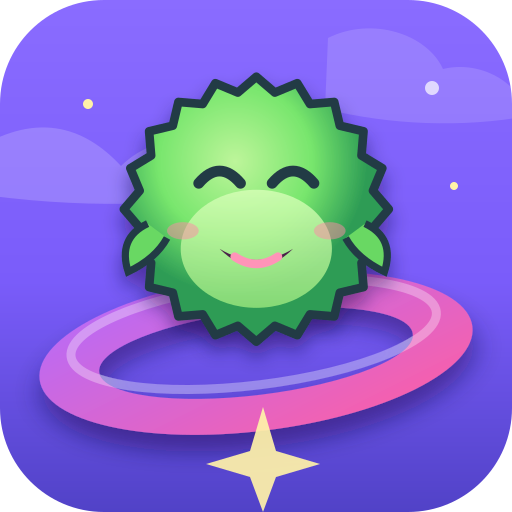

# Almost Clever Games — Public Pages

Public GitHub Pages website, support contact, game artwork, and privacy policies for games published by **Almost Clever Games**.

## Website

- [Almost Clever Games home page](https://dmlapteacru.github.io/almost-clever-pages/)

## Games

| Game | Platform / services | Public page |
|---|---|---|
|  **Merge Orbit** | Android · Offline | [Privacy Policy](https://dmlapteacru.github.io/almost-clever-pages/merge-orbit/privacy-policy.html) |
|  **Puff Up!** | Android · Offline | [Privacy Policy](https://dmlapteacru.github.io/almost-clever-pages/puff-up/privacy-policy.html) |
|  **Lucky Ticket** | Android · Play Games Saved Games · Google Play Billing | [Privacy Policy](https://dmlapteacru.github.io/almost-clever-pages/lucky-ticket/privacy-policy.html) |

Merge Orbit and Puff Up! are designed as offline games. Lucky Ticket uses Google Play Games Services for player sign-in and Saved Games cloud synchronization and Google Play Billing for optional in-app purchases. Its current version has no advertising SDK and no developer-operated third-party analytics service.

## Repository structure

```text
index.html                          Main public landing page
assets/                             Shared branding and game-card artwork
assets/lucky-ticket-icon.png        Lucky Ticket production app artwork
merge-orbit/privacy-policy.html     Merge Orbit privacy policy
puff-up/privacy-policy.html         Puff Up! privacy policy
lucky-ticket/privacy-policy.html    Lucky Ticket privacy policy
```

## Privacy-policy maintenance

Privacy pages must stay consistent with the corresponding shipped game and Play Console Data safety declarations. Update the relevant policy effective date whenever data handling, platform services, advertising/analytics, purchases, account behavior, or cloud storage changes.

Lucky Ticket currently documents Google Play Games Services, Saved Games and Google Play Billing. If its planned future cross-platform/backend architecture is implemented, this policy must be revised before that data path is shipped.

## Artwork conventions

Game-specific public surfaces should use the corresponding game artwork from `assets/` (for example `lucky-ticket-icon.png` for Lucky Ticket). Almost Clever Games branding such as the site header, publisher logo and shared developer banner continues to use the ACG assets.

## Contact

Support: [lector3run@gmail.com](mailto:lector3run@gmail.com)

This repository contains public website content only. Game source code, Android signing material, secrets, APK files, and release bundles are not stored here.

Copyright © 2026 Almost Clever Games. All rights reserved.
